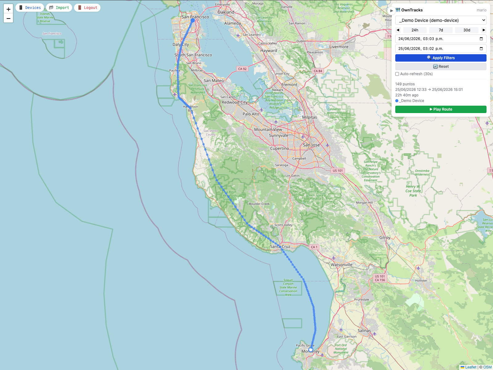
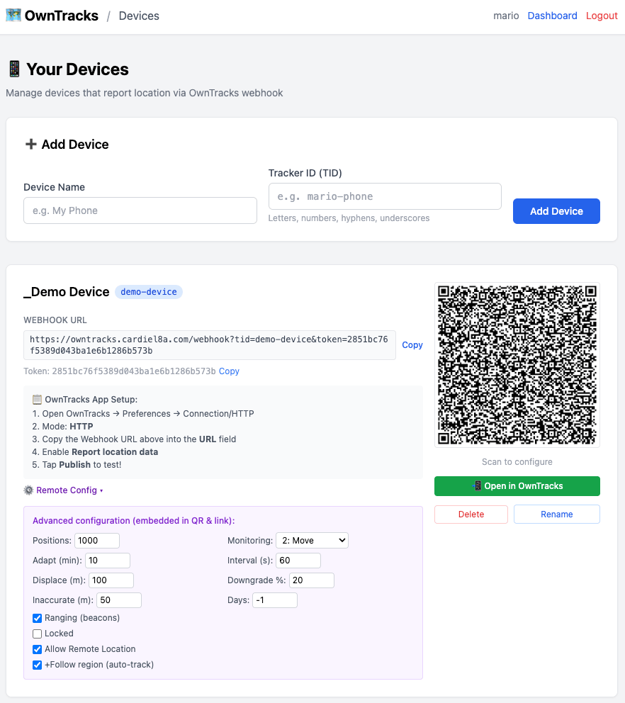

# 🗺️ OwnMapsTimeline

A dead-simple OwnTracks companion server and Google Maps Timeline replacement — receive
GPS location data via webhook, visualize your tracks on an interactive map, and manage
multiple users and devices, all in a single Docker container with zero external services.

## Stack

- **Backend:** PHP 8.3 (Vanilla MVC, Front Controller)
- **Web Server:** Nginx (Alpine)
- **Database:** SQLite (default) or MySQL/MariaDB via PDO
- **Frontend:** HTML5, TailwindCSS, Leaflet.js
- **Auth:** Local (PHP sessions) or Authelia proxy headers
- **Container:** Single Docker image (Alpine, ~90MB)

## Quick Start

### Option A: Docker Compose (build from source)

```bash
# 1. Clone
git clone https://github.com/mcardielo/OwnMapsTimeline.git
cd OwnMapsTimeline

# 2. Configure
cp .env.example .env
# Edit .env if needed (defaults work for first run with SQLite)

# 3. Start
docker compose up -d

# 4. Setup
# Open http://localhost:8090/setup
# Create your admin account (only available when DB is empty + local auth)
```

### Option B: Pre-built image (Docker Hub)

```bash
docker run -d \
  --name owntracks \
  -p 8090:80 \
  -v owntracks_data:/app/data \
  -e AUTH_MODE=local \
  -e TZ=America/Mexico_City \
  mcardielo/ownmapstimeline:latest
# Then open http://localhost:8090/setup
```

## Environment Variables

| Variable | Default | Description |
|----------|---------|-------------|
| `AUTH_MODE` | `local` | `local` (PHP sessions) or `authelia` (proxy header) |
| `AUTH_HEADER` | `Remote-User` | HTTP header set by Authelia |
| `AUTH_LOGOUT_URL` | — | Redirect URL after logout (Authelia mode) |
| `DB_TYPE` | `sqlite` | `sqlite` or `mysql` |
| `DB_HOST` | — | MySQL host |
| `DB_PORT` | `3306` | MySQL port |
| `DB_USER` | — | MySQL user |
| `DB_PASS` | — | MySQL password |
| `DB_NAME` | — | MySQL database name |
| `APP_PORT` | `8090` | Host port to expose |
| `APP_DEBUG` | `false` | Enable PHP error display |
| `TZ` | `America/Mexico_City` | Timezone for logs and timestamps |

> **Note:** When using MySQL, make sure your password does **not** contain `#` — it's
> treated as a comment character in `.env` files.

## Authelia / Reverse Proxy Configuration

When using `AUTH_MODE=authelia`, your reverse proxy (Authelia, Authentik, or NPM) handles
authentication. However, certain paths must be accessible **without authentication** because
they are used by the OwnTracks mobile app or have their own token-based validation:

| Path | Reason | Validation |
|------|--------|------------|
| `/webhook` | OwnTracks app posts location data here | `tid` + `token` in URL |
| `/api/device-config` | QR code / deep link downloads .otrc config | `tid` + `token` in URL |

**Nginx Proxy Manager example:**
```
Location: /webhook
  → Access: Publicly Accessible
Location: /api/device-config
  → Access: Publicly Accessible
```

**Authelia `access_control` example:**
```yaml
access_control:
  default_policy: deny
  rules:
    - domain: "owntracks.example.com"
      resources:
        - "^/webhook.*$"
        - "^/api/device-config.*$"
      policy: bypass
    - domain: "owntracks.example.com"
      policy: two_factor
```

> ⚠️ **Important:** If these paths are behind authentication, the OwnTracks app will get
> 302 redirects to a login page instead of 200 OK — location updates will silently fail.

## OwnTracks App Configuration

The easiest way to configure your device is from the web UI:

1. Go to **Devices** → create a device with a name and TID
2. Expand **⚙️ Remote Config** on the device card to adjust tracking settings
3. Scan the QR code with the OwnTracks app — it sets everything automatically

> **⚠️ Remote Configuration Security Change:** Recent versions of the OwnTracks app
> have disabled remote configuration via deep links and QR codes by default for security
> reasons. If the QR code or "Open in OwnTracks" link doesn't work, you need to manually
> enable it first: open the OwnTracks app → Settings → Remote Control → enable **Allow external configuration**,
> then try again.

Alternatively, configure manually in the OwnTracks app. These values are optimized for
place detection:

| Setting | Value | Purpose |
|---------|-------|---------|
| **Mode** | HTTP | Webhook-based reporting |
| **URL** | `https://your-host.com/webhook?tid=YOUR_TID&token=YOUR_TOKEN` | Webhook endpoint |
| **Monitoring** | 2 (Move) | Report on movement, stop when stationary |
| **Adapt** | 10 min | Stop reporting after 10 min of no movement |
| **Locator interval** | 60 s | Base interval between reports |
| **Locator displacement** | 100 m | Min distance to trigger a report |
| **Downgrade** | 15 % | Reduce accuracy when battery is low |
| **Ignore inaccurate locations** | 50 m | Filter out poor-accuracy fixes |

The TID and token are displayed on the device card in the web UI.

## Screenshots





## Features

- **Multi-device tracking** — manage phones, tablets, and dedicated trackers
- **Multi-user** — each user sees only their own devices
- **Interactive map** — Leaflet.js with OpenStreetMap tiles, color-coded routes per device
- **Route playback** — animate your tracks with adjustable speed
- **GPX import** — bring in tracks from other apps
- **QR provisioning** — scan to configure OwnTracks with one tap
- **Places detection** — automatically detect stay points from your location history
- **Timezone support** — select and display dates/times in any timezone
- **Satellite view** — toggle between map and satellite imagery
- **Speed overlay** — color-coded speed segments on your routes
- **POI markers** — display Points of Interest with images from OwnTracks
- **Tag filtering** — filter locations by device tags with auto date range
- **HTTP Friends** — share device locations between OwnTracks apps via webhook response
- **Device sharing** — share a device's location with another user, each with their own name/color
- **Config drift detection & auto-heal** — daily check that the app config still matches your settings, with automatic fix + alerts
- **Manual place creation** — add places manually and find their visits instantly
- **Single container** — one `docker compose up`, no external dependencies

### Places Detection

OwnMapsTimeline automatically detects "Places" (stay points) from your location history
using a modified DBSCAN algorithm with geofence crossing for visit detection.

- **Per-device detection** — each device gets its own places, preventing mixed signals
- **No chain expansion** — clusters are bounded by epsilon around the origin point,
  preventing route points from chaining into stay points
- **Geofence crossing** — visits detected by entry/exit of the place radius
- **Visit merging** — GPS jitter won't split one visit into multiple (configurable gap)
- **Incremental detection** — only processes new points since last analysis
- **Configurable** — per-user settings for epsilon, min visits, min duration, merge gap, etc.
- **Map integration** — places shown as green circles on the map, filterable by device
- **Manual creation** — add a place by clicking the map or entering coordinates to find its visits instantly

### Device Sharing

Share a device's live location with another user on the same instance (e.g. share a family
car or tracker).

- Share/unshare from the **Devices** page — the recipient immediately sees the device on their dashboard
- Each recipient can set their own display name and color for the shared device
- Shared locations are served via `/api/shared-locations` and rendered on the map alongside your own devices

### Config Drift Detection & Auto-Heal

OwnTracks apps sometimes silently reset their own settings (e.g. switching from "Move" to
"Significant changes" monitoring), which stops reliable reporting. OwnMapsTimeline checks
for this daily and can fix it automatically:

- On the first location report of the day, the webhook replies with a `dump` command
- The app returns its live config, which is compared field-by-field against your stored settings
  (monitoring, mode, positions, adapt, intervals, downgrade, ignore-inaccurate, ranging, etc.)
- If drift is detected, the next location report receives a `setConfiguration` command that
  restores the saved settings automatically
- Results are stored and surfaced as alerts in the dashboard sidebar

> Auto-heal requires the device to have **Remote Configuration** enabled (a device setting,
> enabled by default when you scan the QR / open the config link). If it's disabled on the
> device, drift is still detected and alerted, but the app won't accept the automatic fix.

## Development

```bash
# Rebuild after changes
docker compose up -d --build

# View logs
docker compose logs -f
```
